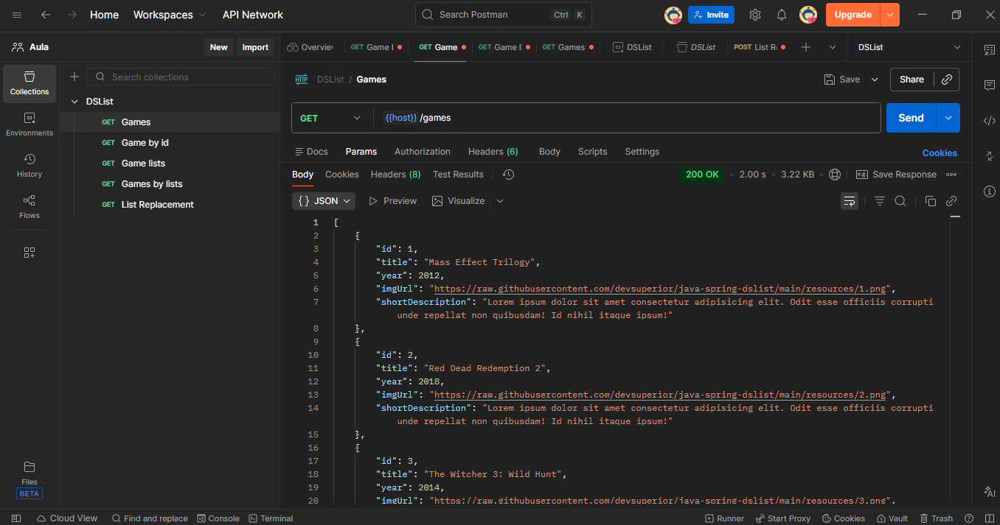
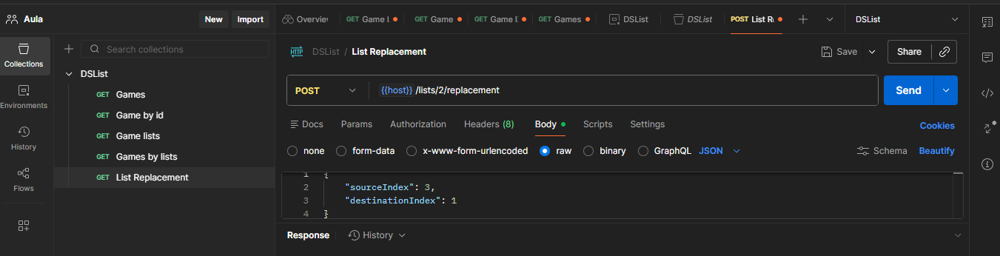

# Sobre o Projeto

O projeto **DSList - Lista de Games** foi desenvolvido com o objetivo de aprimorar habilidades técnicas e consolidar conhecimentos em desenvolvimento backend e APIs REST.

A aplicação permite que o usuário consulte e organize listas de jogos, estruturadas nas categorias **Aventura e RPG** e **Jogos de Plataforma**, armazenadas em um banco de dados relacional. Para o mapeamento das entidades, é utilizada a **JPA (Java Persistence API)**, que relaciona as classes do sistema com as tabelas do banco de dados.

O banco de dados PostgreSQL é executado em um container Docker por meio do Docker Compose, e os dados são inicializados automaticamente utilizando o arquivo `import.sql`, responsável por popular o sistema com listas e jogos previamente cadastrados.

A API REST disponibiliza endpoints para consulta das informações organizadas por categorias.

## Modelo de Domínio DSList

## Tecnologias

### Backend
- Java
- Spring Boot

### Banco de Dados
- PostgreSQL
- SQL

### Ferramentas
- Docker Compose
- Postman

## Endpoints

### Games
- **GET** `/games` — Retorna todos os jogos
- **GET** `/games/{id}` — Retorna um jogo específico

### Lists
- **GET** `/lists` — Retorna todas as listas
- **GET** `/lists/{id}/games` — Retorna todos os jogos de uma lista
- **PUT** `/lists/{id}/replacement` — Altera a posição de um jogo na lista

## Prints da aplicação

### Games / Postman

### Lista 2 / PostgreSQL

### Posição dos games nas listas / PostgreSQL

### Alterar a posição de um game na lista / Postman

