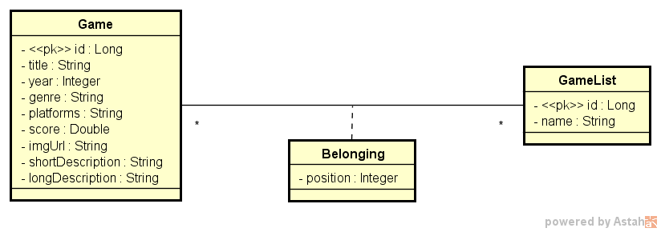
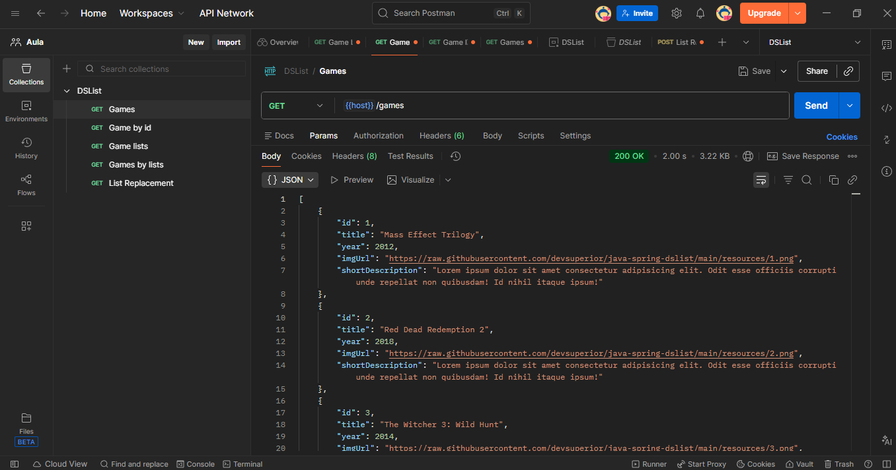
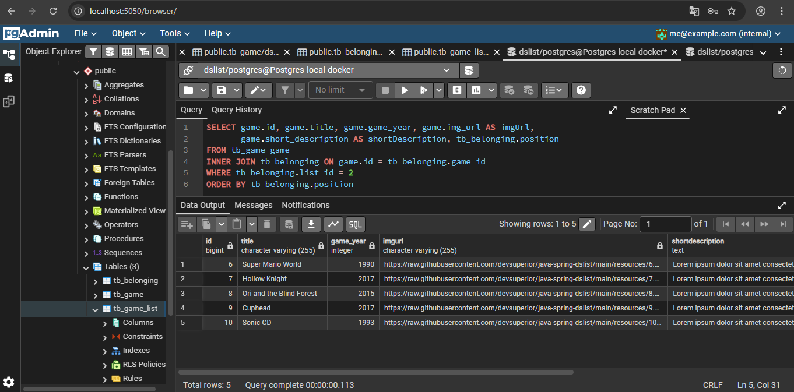
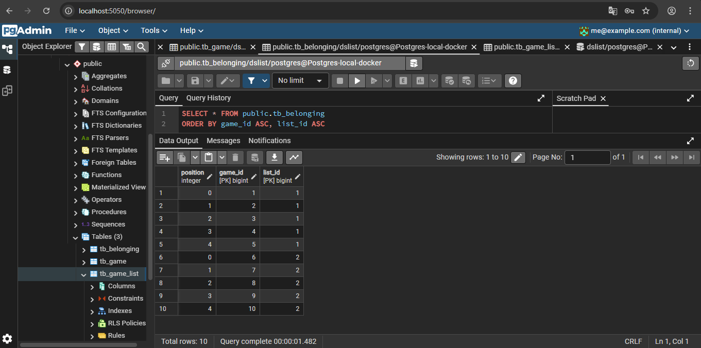
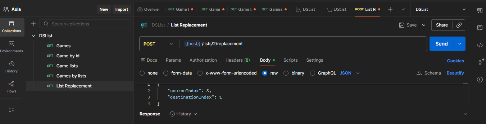

# Sobre o Projeto

O projeto **DSList - Lista de Games** foi desenvolvido com o objetivo de aprimorar habilidades técnicas e consolidar conhecimentos em desenvolvimento backend e APIs REST.

A aplicação permite que o usuário consulte e organize listas de jogos, estruturadas nas categorias **Aventura e RPG** e **Jogos de Plataforma**, armazenadas em um banco de dados relacional. Para o mapeamento das entidades, é utilizada a **JPA (Java Persistence API)**, que relaciona as classes do sistema com as tabelas do banco de dados.

O banco de dados PostgreSQL é executado em um container Docker por meio do Docker Compose, e os dados são inicializados automaticamente utilizando o arquivo `create.sql`, responsável por popular o sistema com listas e jogos previamente cadastrados.

A API REST disponibiliza endpoints para consulta das informações organizadas por categorias.

## Modelo de Domínio DSList


## Tecnologias

### Backend
- Java (Versão 17)
- Spring Boot

### Banco de Dados
- PostgreSQL
- SQL

### Ferramentas
- Docker Compose
- Postman

## Endpoints

### Games
- **GET** `/games` — Retorna todos os jogos
- **GET** `/games/{id}` — Retorna um jogo específico

### Lists
- **GET** `/lists` — Retorna todas as listas
- **GET** `/lists/{id}/games` — Retorna todos os jogos de uma lista
- **PUT** `/lists/{id}/replacement` — Altera a posição de um jogo na lista

## Prints da aplicação

### Games / Postman


### Lista 2 / PostgreSQL


### Posição dos games nas listas / PostgreSQL


### Alterar a posição de um game na lista / Postman


## Docker

O banco de dados PostgreSQL é executado via Docker Compose, utilizando o arquivo:

[docker-compose.yml](Aula3/docker-compose.yml)

### Execução do projeto

1. Faça o clone do repositório:
```bash
git clone https://github.com/kauegadelha/dslist.git
```
2. Abra o projeto em sua IDE (IntelliJ, VS Code, Eclipse, etc).

3. Abra o `Docker Desktop` e mantenha-o rodando.
   
4. No terminal PowerShell como adminstrador, navegue até a pasta:
```bash
cd Aula3
```

5. Execute o Docker Compose:
```bash
docker-compose up -d
```
6. Execute a aplicação Spring Boot. A aplicação conectará automaticamente via `localhost:5433` conforme configurado no application.properties.

7. Acesse o PgAdmin no navegador:
```bash
http://localhost:5050
```
8. Credenciais:
- Email: `me@example.com`
- Senha: `1234567`

9. Register Server:
- Name: `Postgres-local-docker`
- Conection -> host name: `pg-docker`
- Port: `5432` (Porta interna da rede Docker)
- Maintenance database: `mydatabase`
- Username: `postgres`
- Passoword: `1234567`
- Save

10. Databases (Create Database):
- Database: `dslist`
- save

11. Na pasta do projeto, entre em `sql/`, abra o arquivo `create.sql` e copie o código.

12. No pgAdmin, navegue em: `Databases` -> `dslist` -> `Schemas` -> `Public` -> botão direito em `Tables` -> `Query Tool`.

13. cole o conteúdo do `create.sql` e execute o script (botão Play ou F5)

14. Clique com o botão direito em `Tables` -> `Refresh` para visualizar as tabelas criadas.
